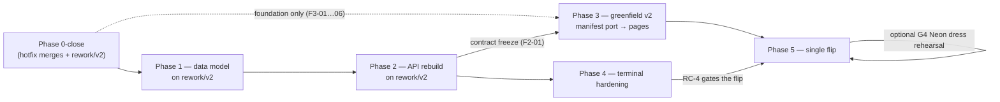

# Rework Master Plan — My-Portfolio

> **Agent**: Phase Planner · **Date**: 2026-10-03 · **Mode**: re-planning
> **Version note — v2, 2026-10-03**: re-planned under Batman's **rebuild-freeze-flip** direction (architect report amended same-day: `architect/2026-10-03-rework-strategy.md`, 26/30); **supersedes the hybrid structure** of v1 (same path, same date). Deleted: staging stack, Phase 3a extract-to-old-prod, old-UI compat layer, three-step flip. Added: `rework/v2` branch model, local dump-restore rehearsal loop (G3), single-flip Phase 5, G4 one-shot Neon dress rehearsal (Batman-optional). Task IDs F1-xx / F2-xx / F4-xx are stable from v1; F3a/F3b merge into **F3**; Phase 0 renumbers (staging tasks dropped); Phase 5 rewritten.
> **v2.1 correction 2026-10-05**: exact ghost name + dump-verified counts (source: `senior-dev/g3-rehearsal-script.md`, baked from `neon-pre-rework-20261002.dump`).
> **v2.2 (2026-10-05)**: Experience-table amendment + F1-04 decisions recorded (source: Annex A `docs/designs/2026-10-05-schema-v2-field-map.md` §6.4, approved-by-process; ratification record `.github/agent-reports/spec-guardian/2026-10-05-annex-a-plan-amendment.md`). Amends F1-04 (decided: D3/D4/D5), F1-06 (`Experience` model + same-commit deletion of read-time serializer validators), F1-07 (Annex A per-field ETL expressions + type-sniffing rule + decision values).
> **v2.3 (2026-10-05)**: F2-01 contract delivered — `docs/designs/2026-10-05-api-contract-v2.md` (9 HTTP + 2 WS; limit/offset pagination on projects; auth rec: drop simplejwt). Ratification record: `.github/agent-reports/spec-guardian/2026-10-05-f2-01-plan-amendment.md`.
> **Inputs**: `.github/project-profile.md` (§2, §5, §10), architect amended report (REBUILD-FREEZE-FLIP + guardrails G1–G8), v1 master plan (task content reused, re-structured), `TODO.md`, `SESSION.md`, `docs/designs/2026-10-03-visual-identity-brief.md` (APPROVED 2026-10-03, unchanged), all four `codebase-auditor` reports, `security-auditor/pre-rework-security-review.md`.
> **Status**: Binding structure once Batman re-ratifies the amended strategy (D1′ replaces v1's D1). Phases 1–2 task content unchanged from v1 (strategy-agnostic); Phases 0/3/5 restructured per this version.

---

## 0. How to read this plan

- **Sizes**: S < 1h · M 1–4h · L 4h+ (split whenever it appears). Honest totals: **~7–10 weeks elapsed with parallelism; ~10–13 weeks of summed task time**. See §12.
- **Agents**: Senior Dev (SD), Test Engineer (TE), E2E Harness Engineer (E2E), QA Gatekeeper (QA), Frontend Designer (FD), Architect (ARCH), Spec Guardian (SG), Security Auditor (SEC), Git Shepherd (GS), Repo Steward (RS), Codebase Auditor (CA).
- **🏛️ BATMAN** = explicit human decision point. Every one is on the decision register (§11) with a pre-recommended default so Batman can approve, not invent.
- **🔍 REVIEW CHECKPOINT** = phase gate; evidence (test output, QA verdict, screenshots) is mandatory before the next phase opens (profile rule 5).
- **Plan assumption (Phase 0-close gate)**: hotfix PR merged, `TERMINAL_PROXY_SECRET` set on both deploys, R2 keys rotated, Dependabot alerts confirmed. The plan starts **after** these.
- **Branch model (binding, G1)**: all rework lands on long-lived **`rework/v2`** (created in Phase 0-close after the hotfix merge). `main` is frozen **except independent security hotfixes**. `rework/v2` rebases onto `main` after every hotfix merge, and at minimum every two weeks.
- **Rehearsal venue (binding, G3)**: **local, scripted, repeatable** — restore `backups/neon-pre-rework-20261002.dump` into the local postgres container (`docker-compose.dev.yml`) → run schema v2 migrations + `etl_v2` → run the full test suite against it → verify row counts (12 `projects_project`, 15 `contact_submissions`, 15 galleries, 56 gallery images — G3-baked, dump-verified). A script in the repo, re-run at every phase gate. **No staging stack exists in this plan.**
- **Non-negotiables carried into tasks**: Dependabot stays frozen until F5-08 (rule 1) · Django pin `>=6.0.7,<6.1` respected (rule 2) · agents commit/tag `--no-sign` (rule 3) · `backups/neon-pre-rework-20261002.dump` is the restore point (rule 4) · design brief is authoritative for all F3 visual work (rule 6) · build gates ON in v2 from commit 1 (rule 7) · report artifacts to `.github/agent-reports/<agent>/`.

### Dependency graph

**Parallelism**: F3 *foundation* (scaffold/tokens/fonts/CI/motion) starts at RC-0 on `rework/v2`; the five manifest modules port tests-first right behind it; F3 *page builds* start at the F2-01 contract freeze (v2 UI builds against the **local** v2 API). Phase 4 starts after F2-03, overlaps F3.

---

## Phase 0 — Pre-flight close-out

**Spec reference**: architect amended report §5 (Phase 0 row), §4 G1; profile §10 Phase 0.
**Phase success criterion**: Batman's four outstanding items are green, ADR 0001 amended to rebuild-freeze-flip and re-ratified, and `rework/v2` exists — pushed, tracking `main`, ready to receive Phase 1. RC-0 no longer gates on any staging mechanism.
**Estimated**: 0.5–1 week (entirely Batman-latency-bound).

**P0-1 · Re-ratify the amended strategy (rebuild-freeze-flip)** — 🏛️ **BATMAN** · [S] · decision · D1′
1. Read architect amended report §0–§5 (recommendation: rebuild-freeze-flip, 26/30; hybrid-as-designed 19 and infeasible under the constraint).
2. Confirm / veto / amend. Veto ⇒ Phases 3/5 re-planned; Phases 1–2 task content stands.
3. Optional G4 call: decide now whether the one-shot Neon dress rehearsal before flip is in scope, pending the free-tier check (F5-02 verifies; default: attempt if free, skip if not).
→ **Deliverable**: decision recorded in SESSION.md; D1′ supersedes v1's D1 (hybrid) ratification.
✓ **Acceptance**: Batman's verdict logged; strategy field in TODO checked.
⇠ **Depends**: —

**P0-2 · Amend ADR 0001 + patch the project profile** — SG · [M] · spec: architect amended §6–§7
1. **Amend** `.github/adr/0001-rework-strategy.md` (exists as Proposed-hybrid — amend, don't recreate): replace decision content with the amended §6 record + re-weighted scoring (§2) + phase shape (§5); preserve the amendment trail (hybrid decision → Batman's constraint → re-weighting → re-decision). Status: Accepted post P0-1.
2. Patch profile: §2 (no staging stack; `rework/v2` branch model + `portfolio_ui_v2/` as rework-time components; single-flip topology with the minutes-apart dual-deploy window owned by the runbook), §4 (`portfolio_ui_v2/`, `.github/adr/`), §5 (rules: main-frozen-except-security + all-rework-on-rework/v2 + periodic rebase; manifest port tests-first, never rewrite; v2 gates ON from commit 1; G3 local rehearsal mandatory pre-gate), §8 (ADRs row → `.github/adr/`), §9 (vocabulary: rework/v2, freeze, single flip, local rehearsal, Neon one-shot rehearsal, flip runbook — no staging vocabulary), §10 (this plan's phase shape).
→ **Deliverable**: amended ADR 0001 + patched profile.
✓ **Acceptance**: ADR Accepted with amendment trail intact; profile diff reviewed by Architect; vocabulary matches ADR.
⇠ **Depends**: P0-1.

**P0-3 · Merge the hotfix PR** — 🏛️ **BATMAN** · [S]
1. Review `fix/security-hotfix-pre-rework` (2 commits, +1157/−146, QA PASS; terminal 175 / api 74 tests).
2. Merge; confirm CI deploys api + terminal (paths match workflow filters); smoke `/healthz` + one terminal session.
3. This is the **first exercise of the main-frozen-except-security rule** (G1): the only `main` merge before the flip.
→ **Deliverable**: merged PR, deployed hotfix.
✓ **Acceptance**: prod terminal service enforces shared secret (unauthenticated dial fails closed) and env-allowlisted bash (`echo $AWS_SECRET_ACCESS_KEY` returns empty).
⇠ **Depends**: —.

**P0-4 · Set `TERMINAL_PROXY_SECRET` on both deploys** — 🏛️ **BATMAN** · [S]
1. Generate secret; set identically in DO (api) and terminal service env at deploy time.
✓ **Acceptance**: terminal demo works end-to-end in prod (proxy hop accepted); absent/mismatched secret fails closed.
⇠ **Depends**: P0-3 (code that reads it is on the branch).

**P0-5 · Rotate the R2 key pair** — 🏛️ **BATMAN** · [S]
1. Rotate in Cloudflare; update DO env vars; confirm media uploads + terminal demo-file downloads work.
✓ **Acceptance**: new key serves `media.aouichou.me` + `project-files/*.zip`; old key rejected.
⇠ **Depends**: P0-3.

**P0-6 · Confirm the 3 Dependabot alerts** — 🏛️ **BATMAN** · [S]
1. Check github.com/aouichou/My-Portfolio/security/dependabot vs candidates (`mermaid@11.17.2`, `next@16.3.4`, `serve@14.2.6`).
2. Triage: all stay frozen (rule 1) — `serve` deleted in the F3 dead-deps purge; `mermaid`/`next` re-baselined at F5-08.
✓ **Acceptance**: alert IDs recorded in SESSION.md with disposition.
⇠ **Depends**: —.

**P0-7 · Create `rework/v2` and push** — SD (or Batman) · [S] · spec: architect §4 G1
1. After P0-3 merges: `git checkout main && git pull && git checkout -b rework/v2 && git push -u origin rework/v2`.
2. Confirm branch protection posture: `main` merge rights restricted during rework (warn-only at minimum); `rework/v2` is the default review target.
3. Start the rebase cadence: rebase onto `main` after every hotfix merge, minimum every two weeks (expect friction on `portfolio-terminal/main.py` — rebase early, not at flip time).
→ **Deliverable**: long-lived `rework/v2` on origin.
✓ **Acceptance**: `git ls-remote` shows `rework/v2` at `main`'s head; first commit lands on it in Phase 1.
⇠ **Depends**: P0-3.

**P0-8 · Write the G3 rehearsal script (v1)** — SD · [S/M] · spec: architect §4 G3
1. `scripts/rehearse-restore.sh` (or make target): tear down the compose postgres volume → restore `backups/neon-pre-rework-20261002.dump` into the local postgres container → print row counts (12 `projects_project`, 15 `contact_submissions`, 15 galleries, 56 gallery images — G3-baked, dump-verified) → exit non-zero on any mismatch.
2. Prove it once end-to-end; document usage in `docs/DOCKER_DEV_GUIDE.md`.
→ **Deliverable**: committed script + one clean run's pasted output.
✓ **Acceptance**: script runs unattended to green from a cold compose down; counts match the audit.
⇠ **Depends**: — (independent of P0-3; land on `rework/v2` after P0-7).

**P0-9 · Tag the pre-Phase-1 baseline** — GS · [S]
1. After P0-3 merges: tag `pre-phase-1` (`--no-sign`), push; confirm `pre-rework-backup` branch still current.
✓ **Acceptance**: `git tag -l` shows both tags; dump still present and git-ignored.
⇠ **Depends**: P0-3.

### 🔍 RC-0 — Phase 0 gate (all must be true)
- P0-1…P0-9 checked; hotfix verified live in prod; ADR 0001 Accepted (amended); `rework/v2` pushed; G3 script green once.
- **Report**: HoE compiles gate evidence into `.github/agent-reports/phase-planner/rc-0.md`.

---

## Phase 1 — Content & data model *(task content unchanged from v1 — strategy-agnostic; venue now local)*

**Spec reference**: profile §10 Phase 1; data-schema audit §3 (loss-risk list), §5 (migration history), §6 (seeds), §7 (volumes), §9 recs 1–8; security review §4 (dumps hygiene).
**Phase success criterion**: the **local** postgres container (restored from the mandatory dump via the G3 script) runs schema v2 with **all dump-verified business rows (12 projects, 15 contact submissions, 15 galleries, 56 gallery images) migrated and field-level verified — including every rescued rich-content field from the deprecated internship tables** — reproducible from seeds, with prod untouched.
**Estimated**: 1.5–2 weeks.
**Runs**: on `rework/v2`, against the local postgres restored by `scripts/rehearse-restore.sh` (P0-8). Prod DB is not touched until the Phase 5 flip.

**F1-01 · Restore prod dump locally + prove the loop** — SD · [S]
1. Run `scripts/rehearse-restore.sh` (P0-8); snapshot the restored DB (`local-phase1-<date>` via `pg_dump` to `backups/`, git-ignored).
2. Loop = script re-run from cold; verify repeatability a second time.
→ **Deliverable**: restored local DB + verified restore procedure (referenced by the flip runbook stub, F5-01).
✓ **Acceptance**: restore reproduces the known row counts (12 projects, 1 internship, 3 internshipprojects, 15 galleries, 56 gallery images, 15 contact submissions) on two consecutive runs.
⇠ **Depends**: RC-0.

**F1-02 · Reconcile the ghost migration locally** — SD · [M] · spec: profile §5.4; data-schema §5, §9.4
1. Run `showmigrations projects` + `makemigrations --check` against the restored copy; diff `django_migrations` rows vs on-disk files — confirm the ghost row `0008_alter_galleryimage_image_alter_project_thumbnail` (applied 2025-11-20 16:46, absent on disk; previously recorded by shorthand — exact name verified from the prod dump during G3 baking) and that the on-disk `0008_alter_galleryimage_image_alter_project_thumbnail_and_more` is recorded applied (17:00) and is NOT the ghost.
2. Write a tiny reconciliation migration (RunSQL `DELETE FROM django_migrations WHERE app='projects' AND name='0008_alter_galleryimage_image_alter_project_thumbnail';` with a no-op reverse + comment) so history is clean and **reviewable**, not hand-hacked per environment.
3. Apply locally; re-run `showmigrations` + `makemigrations --check` (must exit 0, zero drift).
4. Record the exact sequence for prod reuse in the flip runbook (F5-01).
→ **Deliverable**: reconciliation migration + verified clean history.
✓ **Acceptance**: local `showmigrations` shows exactly the on-disk chain `[X]`0001–0009, no extras; `makemigrations --check` clean.
⇠ **Depends**: F1-01.

**F1-03 · Write the unified schema v2 spec (field map)** — ARCH + SD · [M] · spec: data-schema §2–§3, §9.1–9.3, 9.8
1. Extend `Project`: add `personal` to `PROJECT_TYPE_CHOICES`; add the rescued rich-content fields with **canonical shapes** — `subtitle` (char), `overview` (text, distinct from `readme`), `technologies` (JSON list of objects: name/icon/category/level — the *rich* Internship shape wins), `code_samples` (JSON list of objects), `documentation` (JSON list), `key_features` (JSON list; deprecate bare `features` or alias), `architecture_diagrams` (JSON list replacing single-text `architecture_diagram` — migration converts), `related_documentation` (JSON list), `created_at`/`updated_at`, `order` (int, for ledger ordering).
2. Decide canonical JSON policy per audit rec §9.3: **array-of-objects everywhere**; document the coercion rules for legacy dict-shaped `stats`/`code_snippets`.
3. Fix known model debts in the spec: `clean()` thumbnail requirement vs universal `bypass_validation=True` (make validation real or delete it — recommend: require thumbnail only for featured), global-unique slug + auto-suffix policy, `architecture_diagram` serializer `write_only` bug (decide: expose in v2 detail).
4. State explicitly: `Internship`/`InternshipProject` are **frozen** (no new fields), dropped in Phase 2 after rescue verification; `Gallery`/`GalleryImage`/`ContactSubmission` survive as-is.
→ **Deliverable**: schema spec table (old field → new field → transform) appended to this plan as Annex A, referenced by all Phase 1–2 tasks.
✓ **Acceptance**: ARCH + Batman review the mapping table; every loss-risk field from data-schema §3 has a destination or an explicit, Batman-approved drop.
⇠ **Depends**: F1-02 (history clean before new migrations).

**F1-04 · Content decisions** — 🏛️ **BATMAN** · [S] · decision · ✅ **DECIDED 2026-10-05** (v2.2)
> **D3** — `mistral-realms` → `personal` (fixture-side in F1-09: seed-only row, absent from the prod dump; all 12 prod rows stay school/internship) · **D4** — `Experience.role = "Fullstack Engineer intern"` (ETL writes it; hero copy polish stays in F3-17; never sourced from the erroneous CV ledger) · **D5** — keep all 15 contact rows; retention policy → Backlog (post-rework); G6 delta-copy mandatory regardless.
1. Personal-project set: which rows become `project_type='personal'` (candidate: `mistral-realms`; any others?).
2. Qynapse role copy: approved title = **Fullstack Engineer intern** (brief header note); brief §5 rewrite #2 is QA-flavored and must be rewritten to the Fullstack framing before F3 ships — confirm who drafts it (FD in F3-17).
3. Contact PII retention: keep-all vs prune (>N months) for the 15 `contact_submissions` rows; delta-copy at flip is mandatory either way (F5-03).
✓ **Acceptance**: three answers logged in SESSION.md; F1-07/F3-17/F5-03 consume them.
⇠ **Depends**: F1-03 (draft mapping visible).

**F1-05 · Write failing tests for schema v2 (test-first)** — TE · [M] · spec: profile rule (tests precede implementation)
1. Model tests: `personal` choice accepted; new rich fields round-trip; canonical JSON validators reject legacy dict shapes where spec says so; timestamps/order defaults; slug policy incl. personal rows.
2. Serializer tests: v2 detail exposes rescued fields; list serializer groups/filters by all three types.
3. All red against current code (they define v2).
→ **Deliverable**: `tests/unit/test_models_v2.py`, `test_serializers_v2.py` (failing).
✓ **Acceptance**: suite fails for exactly the v2 gaps — no unrelated failures; reviewed by SD.
⇠ **Depends**: F1-03.

**F1-06 · Implement models v2 + migrations locally** — SD · [M]
1. Implement spec Annex A in `models.py` (+ validators), keeping deprecated models untouched — **including the new `Experience` model** (Annex A §2.2: thin grouping table, rescue destination for the deprecated `Internship`'s hero content; `Project.experience` FK nullable, `on_delete=PROTECT`).
2. **Same commit**: **delete the read-time serializer validators** `validate_code_snippets`/`validate_code_steps` from `ProjectSerializer` — double-transform hazard (Annex A §5 risk #3): if ETL canonicalizes while those validators live, content is transformed twice (or the paths disagree). The serializer becomes a pass-through; F1-05 asserts it.
3. `makemigrations` → new `0010_schema_v2` (additive only — no data destruction; includes the `Experience` table + FK); apply on the restored local DB after F1-02's reconciliation.
4. F1-05 suite green; legacy suite (62→74 tests post-hotfix) still green.
→ **Deliverable**: v2 models + applied migration.
✓ **Acceptance**: full API test suite passes against the restored local DB; `makemigrations --check` clean; deprecated tables still present and populated (rescue not yet run).
⇠ **Depends**: F1-02, F1-05.

**F1-07 · Build the idempotent ETL command** — SD · [M] · spec: data-schema §9.2; architect §3.5; Annex A §2 + §5
1. Management command `etl_v2` (`--dry-run` default, `--apply`, `--verify`): rescues rich content from `internship`/`internshipproject` rows into the matching unified `Project` rows (match on slug — ids 14/15/16 ↔ 4/5/6) **and into the new `Experience` row** (1:1 from the single `Internship` row — Annex A §2.2), using **Annex A §2's per-field ETL expressions verbatim**, normalizing to §3.4 canonical shapes.
2. **Type-sniff at runtime, never trust help_text** (Annex A §5 risk #2 — declarations lie): `technologies` is a flat string list (the `{name,icon,category,level}` objects never existed in prod), `stats`/`impact_metrics` are dicts (not lists), `key_features` are flat strings. Coercion helpers branch on `isinstance`; `--verify` prints the detected type per field per row.
3. **F1-04 decision values baked in (v2.2)**: retype `mistral-realms` → `personal` (fixture-side in F1-09 — seed-only, not in the prod dump); write `Experience.role = "Fullstack Engineer intern"` (D4).
4. Verification report: per-field diff table (old value → new value → status), row counts, orphan detection.
5. Idempotent: safe to re-run; skip-if-already-migrated markers.
→ **Deliverable**: `etl_v2` command + report generator.
✓ **Acceptance**: `--dry-run` against the restored local DB reports 100% field coverage of the Annex A rescue list with zero unmapped losses; unit tests cover each transform.
⇠ **Depends**: F1-06, F1-04 (personal set applies here too — typed via CLI arg).

**F1-08 · Rehearse the ETL locally** — SD + TE · [M]
1. Re-run `scripts/rehearse-restore.sh` → `etl_v2 --apply` → verification report (this is the **G3 loop in its full form**; it repeats at every phase gate).
2. Field-level spot checks (TE): every rescued field renders correct content for the 3 internship projects; school projects untouched; contact submissions intact.
3. Break-and-retry drill: re-run to prove idempotency; simulate a mid-run failure to prove safety.
4. Record timings (inform the flip-window estimate in F5-01).
→ **Deliverable**: rehearsal report `.github/agent-reports/senior-dev/etl-rehearsal.md`.
✓ **Acceptance**: report shows 0 unmapped fields, 0 orphans, idempotent re-run = 0 changes; TE counter-signs.
⇠ **Depends**: F1-07.

**F1-09 · Replace the seed strategy** — SD · [S] · spec: data-schema §6, §9.6–9.7
1. Generate v2 fixtures from the post-ETL local data (12 projects incl. personal typing, galleries; `--exclude` contact PII).
2. Archive: move `projects.json` + `fixtures/internship_data.json` to `docs/data-archive/` (or `backups/`) with a README noting they are historical, never re-imported (the unauth import endpoint died in the hotfix; the CLI importer's field whitelist is updated or deleted in Phase 2).
3. Prove round-trip: fresh empty DB → fixtures → data identical to rehearsal output.
→ **Deliverable**: v2 fixtures + archived legacy seeds.
✓ **Acceptance**: fresh-DB load reproduces row counts and spot-checked fields; grep shows no code path loading the archived files.
⇠ **Depends**: F1-08.

**F1-10 · Update Django admin for schema v2** — SD · [S] · spec: api-surface appendix (admin fieldsets omit internship fields today)
1. Rework `ProjectAdmin` fieldsets: type-aware layout (company/role/dates for internship; all rich-content editors), personal fields, `order`.
2. Remove `InternshipAdmin`/`InternshipProjectAdmin` **in Phase 2** (F2-05) — not here; note it.
→ **Deliverable**: v2 admin.
✓ **Acceptance**: admin can create/edit all three project types incl. every rescued field (manual pass locally).
⇠ **Depends**: F1-06.

**F1-11 · QA verification pass** — QA · [M]
1. Run full suites (api + terminal) against the restored local DB; coverage not below baseline.
2. Verify acceptance criteria of F1-01…F1-10 with pasted evidence (rule 5).
→ **Deliverable**: `.github/agent-reports/qa-gatekeeper/phase-1-verification.md`.
✓ **Acceptance**: QA verdict PASS, or listed blockers fixed and re-verified.
⇠ **Depends**: F1-01…F1-10.

### 🔍 RC-1 — Phase 1 gate
- Schema v2 live on the restored local DB; ETL rehearsal report clean; seeds reproducible; prod untouched (diff `showmigrations` prod vs pre-phase to prove it); QA PASS; G3 loop green.

---

## Phase 2 — API rebuild *(task content unchanged from v1 — strategy-agnostic; compat layer DELETED)*

**Spec reference**: profile §10 Phase 2; api-surface audit §2 (endpoint table), §5 (security), §10 (rework implications); security review §5(b); architect amended §5 (Phase 2 row).
**Phase success criterion**: the local v2 API serves the frozen v2 contract with the deprecated internship subsystem demolished, dead code purged, settings hygiene items closed, and the suite covering consumers/storage/commands that sit at 0% today.
**Estimated**: 1.5–2 weeks (overlaps F3 foundation/port).
**Note**: **F2-01 is the mid-phase gate that unblocks all F3 page builds** — sequence it first. **No old-UI compat layer exists in this plan** (verified unnecessary: the old UI freezes on `main` against the old API; both retire in the same flip merge; the minutes-long dual-deploy window at flip is owned by the runbook, F5-01).

**F2-01 · Freeze the API contract v2** — ARCH · [M] + 🏛️ **BATMAN** sign-off
1. Endpoint surface (from schema v2): `GET /api/projects/` (filters: `project_type` ∈ {school, internship, personal}, `is_featured`, `include_all`), `GET /api/projects/{slug}/` (full detail incl. rescued fields + galleries + `architecture_diagrams`), `GET /api/projects/{slug}/files/`, `POST /api/contact/`, `GET /api/auth/terminal-token/`, one health endpoint (`/healthz` — dedupe `/api/health/`), WS `/ws/terminal/{slug}/` + `/ws/health/` (unchanged wire protocol).
2. Serializer schemas: field-by-field tables incl. canonical JSON shapes; error shapes; the `write_only` architecture-diagram bug resolved (expose it).
3. Emit machine-readable contract (DRF OpenAPI/schema export) + a TS types file for F3.
→ **Deliverable**: `docs/specs/api-contract-v2.md` + generated schema + `types/api-v2.ts`.
✓ **Acceptance**: Batman signs the freeze; F3 page-build track unblocked; any later change requires an ADR-note amendment, not silent drift.
⇠ **Depends**: F1-06 (schema exists); can start in parallel with F1-07/08 using the spec.

> **✅ DELIVERED 2026-10-05 (v2.3)** — contract lives at `docs/designs/2026-10-05-api-contract-v2.md` (deviation ratified below). 9 HTTP + 2 WS routes, all with named v2 page consumers; limit/offset pagination (default 24, max 100) on the projects list; auth rec: **drop simplejwt** (D6, removal folds into F2-05); demo enablement via serializer fields + `has_demo` query param (no dedicated endpoint); errors DRF-native with 429 key standardized to `detail`.
> **Two Batman decisions outstanding** (architect report `architect/2026-10-05-f2-01-api-contract-v2.md`):
> - **Q1 — freeze-blocking, PENDING**: kill the featured gate on `/api/projects/` (list = full ledger; `is_featured` stays a field). Recommended YES. Freeze is not signed until this lands.
> - **Q2 — non-blocking, recommended**: card overline year has no reliable source — ship type-only overlines; add nullable `display_year` later iff missed. Recommended YES (type-only).
>
> **Deviations ratified (this v2.3)**: (1) deliverable path `docs/specs/api-contract-v2.md` → `docs/designs/2026-10-05-api-contract-v2.md` — consistent with the schema map (Annex A) living in `docs/designs/`; `docs/specs/` does not exist. (2) DRF OpenAPI machine-readable export (original pt 3) **deferred to post-freeze** (Phase 5 revisit) — `drf-spectacular` would be a new dependency mid-freeze; TS types (`types/api-v2.ts`, F3-04) + the F2-02 test suite carry the machine contract until then.

**F2-02 · Write endpoint tests first** — TE · [M]
1. Tests for every contract-v2 route incl.: personal-type filtering; detail returns rescued fields; 404s; contact validation; terminal-token mint validation paths.
2. Red first (against pre-rebuild code), then green as F2-03 lands.
→ **Deliverable**: `tests/integration/test_api_v2.py`.
✓ **Acceptance**: contract coverage 100% of the route table; reviewed vs F2-01 tables.
⇠ **Depends**: F2-01.

> **Note (v2.3)**: the suite must **encode Q1's settled answer** — whichever way Batman rules on the featured gate (recommended: kill it; list = full ledger, `is_featured` stays a field), the projects-list tests assert that behavior explicitly, so the decision is executable, not prose.

**F2-03 · Rebuild views + serializers on schema v2** — SD · [M]
1. Rewrite `ProjectViewSet`/`ProjectDetail`/serializers per contract; remove the hardcoded `ft_transcendence` debug-logging block (api-surface §2).
2. Dedupe health endpoints to `/healthz`; delete the `/api/` header-echo view (already removed on the hotfix branch — verify gone post-P0-3 merge, keep regression test).
→ **Deliverable**: v2 API running locally.
✓ **Acceptance**: F2-02 suite green; the old UI (on `main`) is untouched by construction — nothing in this phase deploys.
⇠ **Depends**: F2-02, F1-06.

**F2-04 · Remove the deprecated internship subsystem** — SD · [M] · spec: api-surface §1.3, §10.1; data-schema §9.1
1. Delete: 4 original routes, 3 serializers, `InternshipViewSet`/`InternshipProjectViewSet`, `InternshipAdmin`/`InternshipProjectAdmin`, broken `migrate_internships.py` (audit: would crash), working `migrate_internship_to_projects.py` (superseded by `etlv2`-equivalent).
2. Final migration `0011_drop_deprecated`: drops `projects_internship` + `projects_internshipproject` tables — **only after** exporting a JSON archive of both tables to `backups/` (pre-drop evidence, git-ignored) and re-verifying F1-08's report.
3. Deprecated routes now return 404 on `rework/v2`; in prod the **old API keeps serving them until the flip** (frozen `main`).
→ **Deliverable**: demolition migration + archive.
✓ **Acceptance**: local schema has zero `internship*` tables; admin loads without the removed registrations; F2-02 suite green.
⇠ **Depends**: F2-03, F1-08, F1-09 (seeds no longer reference deprecated models).

**F2-05 · Purge dead code (api)** — SD · [M] · spec: api-surface §1.5–1.7, §10.4; security review N6
1. Delete files: `pty_manager.py` (root), `projects/middleware.py`, `projects/AppConfig.py`, `healthcheck.py` (unrouted), unrouted views (`ProjectList`, `project_by_slug`, `RateLimitedTokenObtainPairView` — see F2-07), `TERMINAL_SETTINGS` block.
2. Drop deps from `requirements.txt`: `docker`, `guacamole` (supply-chain cruft, N6), `APScheduler` — respecting the Django/DRF pins (rule 2).
3. Decide CSP constants: install `django-csp` and wire, or delete the inert constants (recommend: delete now, real CSP is an F3/5 concern at the edge).
4. Delete repo-root `seccomp-profile.json` duplicate (keep `portfolio-terminal/`'s — F4-07 owns its future).
→ **Deliverable**: purge commit on `rework/v2`.
✓ **Acceptance**: grep-verified zero references; full suite green; `pip check` clean.
⇠ **Depends**: F2-03 (view surface settled).

> **Note (v2.3)**: two contract-v2 items fold in here: (1) **simplejwt removal** (contract §5 — uninstall `djangorestframework-simplejwt`, delete the unrouted `RateLimitedTokenObtainPairView`; guest terminal JWT is hand-rolled PyJWT, unaffected) and (2) the **`thumbnail_url` shadowing fix** (contract §2.2 — `SerializerMethodField` shadows the model's external-URL escape hatch; frozen resolution: absolute R2 URL when `thumbnail` is set, else the model's external `thumbnail_url`, else `null`; implementation lands in F2-03's serializer rebuild, this task verifies it survives the purge). Full §7 kill-list per the contract.

**F2-06 · Decide the auth story** — 🏛️ **BATMAN** decision + SD · [S decision]
1. Recommendation on the table: **drop SimpleJWT entirely** (read-only portfolio; admin uses session auth; terminal guests keep the purpose-scoped HS256 mint, hardened in Phase 4) and **park the Neon extensions** (`pg_session_jwt`, `neon_auth`, `pgrst`) as documented-but-unused — revisit only if a real auth need emerges (profile §12 note).
2. Batman approves or defers; outcome recorded as a short ADR-note inside the contract doc (or ADR 0002 if wired instead).
→ **Deliverable**: decision + (if drop) removal folded into F2-05.
✓ **Acceptance**: no unrouted auth view classes remain; decision documented.
⇠ **Depends**: F2-01.

**F2-07 · Settings + deploy hygiene** — SD · [M] · spec: api-surface §5, §7, §9, §10.5–10.9; security review §5(b)
1. Collapse `CSRF_TRUSTED_ORIGINS` to one definition incl. `www` + api hosts; single explicit CORS list (no wildcard-shaped dead entries); `ALLOWED_HOSTS` = the real 3 hosts (drop `*.onrender.com` / `*.ondigitalocean.app`).
2. `SESSION_COOKIE_SECURE`/`CSRF_COOKIE_SECURE`/`SECURE_SSL_REDIRECT` unconditional in prod (currently `RENDER`-gated).
3. Rate limiting: `RATELIMIT_IP_META_KEY='HTTP_X_FORWARDED_FOR'` (after confirming DO edge header), counters to Redis (not LocMem) — fixes the one-global-bucket bug (N3).
4. Remove the Render URL default in `consumers.py:65` (env-only); remove `makemigrations`-at-boot from `entrypoint.sh` (audit anti-pattern that birthed the ghost migration); fix `.env` load path for DO build context.
→ **Deliverable**: settings overhaul commit on `rework/v2`.
✓ **Acceptance**: local boots from committed migrations only (no boot-time generation); 429 (not 500) from a tripped limit in a test; CSRF/CORS each defined exactly once.
⇠ **Depends**: F2-03.

**F2-08 · Backfill coverage for the 0% surfaces** — TE · [M] · spec: api-surface §8
1. Tests: `consumers.py` handshake (valid/invalid/expired/wrong-purpose token → 4003), `storage.py` URL generation, `etl_v2` command (from F1-07), terminal-token validation paths.
→ **Deliverable**: new test modules.
✓ **Acceptance**: views/consumers/storage/commands each ≥ 70% lines on the local run; suite green.
⇠ **Depends**: F2-03, F2-04.

**F2-09 · Security verification pass on the v2 API** — SEC · [M]
1. Re-verify security-review items C5–C10, N3, N6 are closed on the local v2 API; adversarial pass over the new routes.
→ **Deliverable**: `.github/agent-reports/security-auditor/phase-2-verification.md`.
✓ **Acceptance**: zero open High/Critical on the v2 API; mediums dispositioned.
⇠ **Depends**: F2-03…F2-08.

**F2-10 · QA verdict + contract-freeze confirmation** — QA + 🏛️ **BATMAN** · [M]
1. Full regression locally (api + terminal + v2-UI-against-local-v2-API smoke via the F3 dev stack, once F3-07 exists).
2. Batman countersigns the frozen contract (post-implementation delta vs F2-01, if any).
→ **Deliverable**: QA report + signed freeze.
✓ **Acceptance**: QA PASS; F3 page-build track formally opened (if not already via F2-01).
⇠ **Depends**: F2-09.

### 🔍 RC-2 — Phase 2 gate
- Contract v2 frozen and signed · deprecated tables dropped (archive exists) · purge + hygiene landed on `rework/v2` · coverage backfilled · SEC + QA PASS · G3 loop green.

---

## Phase 3 — Greenfield `portfolio_ui_v2/` *(replaces v1's 3a/3b split — no extract-to-old-prod)*

**Spec reference**: `docs/designs/2026-10-03-visual-identity-brief.md` — **AUTHORITATIVE for every task in this phase** (profile rule 6); architect amended §4 G2, G7, §5 (Phase 3 row).
**Phase success criterion**: v2 renders every core page in both color modes against the **local** v2 API, passes the brief's §7.4 QA gates and §6 blacklist greps in CI, with the homepage signature (live terminal hero) **demo-ready locally** at the anti-stall milestone — and prod untouched throughout.
**Estimated**: 3.5–5 weeks. **Foundation + manifest port (F3-01…08) start at RC-0**; **page builds (F3-09 onward) start at F2-01 contract freeze**.
**Build order**: homepage-with-signature **first** (anti-stall risk mitigation — see R1), then projects index → project detail → demo terminal → contact; internship content folds into unified project pages (no `/internship` tree in v2).
**Manifest port rule (G2, binding)**: the five surviving modules port **tests-first** into the v2 skeleton — tests written or ported before/with each module; never rewritten from scratch. `ThemeContext` ports structurally; its values re-token per brief §7.1.

**F3-01 · Scaffold `portfolio_ui_v2/` with gates ON from commit 1** — SD · [M] · spec: profile rule 7; architect §4
1. Next.js (App Router, current major) + TS + ESLint + Tailwind 4 + Jest/RTL skeleton; **never** set `ignoreBuildErrors`/`ignoreDuringBuilds`; CI workflow file in the same commit.
2. Jest config mirrors old app's isolation patterns; initial smoke test renders a placeholder.
3. All F3 work lands on `rework/v2` only.
→ **Deliverable**: scaffold repo-in-repo + `test-ui-v2` CI workflow green.
✓ **Acceptance**: commit 1 fails CI if types/lint/tests fail (verified by intentionally breaking once in a scratch branch).
⇠ **Depends**: RC-0.

**F3-02 · Port `url-security` tests-first** — TE → SD · [M] · spec: reuse manifest (G2); security review C14
1. **Tests first**: characterization tests pinning current behavior — `getConfiguredApiBaseUrl()` (env → fallback chain incl. localhost override), `ensureSafeApiUrl` allowlist (same-origin + path-prefix), rejection vectors (absolute-URL injection, scheme swaps, cross-host). Red until the module exists in v2.
2. Port `url-security.ts` into `portfolio_ui_v2/src/lib/` with a stable public surface, no behavior change; suite flips green.
→ **Deliverable**: `lib/url-security/` + green suite.
✓ **Acceptance**: suite green in v2; a deliberately weakened allowlist fails it (mutation check); old app on `main` untouched.
⇠ **Depends**: F3-01.

**F3-03 · Port `svg-sanitizer` tests-first + close the cheap gaps** — TE → SD · [S/M]
1. **Tests first**: DOM-walker pinned incl. XSS vectors (`<script>`, event handlers, `javascript:`) and the **known gaps** (`data:` URIs, `<use href>`, `<animate>`/`<set>`) as explicit red tests.
2. Port the module; fix the flagged gaps (block `data:` URIs, add `use`/`animate`/`set` to deny sets) — flip gap tests green. Trust boundary stays admin-authored input (C14 calibration); DOMPurify adoption explicitly **not** taken (would change the manifest).
→ **Deliverable**: `lib/svg-sanitizer/` hardened + green suite.
✓ **Acceptance**: gap tests green; no other behavior change.
⇠ **Depends**: F3-01.

**F3-04 · Port `api-client` + React Query layer tests-first** — TE → SD · [M]
1. **Tests first**: interceptor tests (attach/transform/reject paths) + `normalizeProject` shape-drift patch behavior.
2. Port `api-client.ts` (axios instance + interceptors wired to the ported url-security) and the React Query hooks into `lib/api/`; point base URL env at the **local** v2 API.
→ **Deliverable**: `lib/api/` module + tests.
✓ **Acceptance**: hooks fetch live local v2-API data in a route stub; interceptor tests green; types compile strict.
⇠ **Depends**: F3-02 (F2-01 for `types/api-v2.ts`; F3-07 formalizes).

**F3-05 · Port `LiveTerminal` tests-first** — TE → SD · [M] · spec: brief §3 Candidate A; frontend-inventory §8.6
1. **Tests first**: extraction-surface tests — WS URL resolution (localhost vs prod rewrite), 15s connect-timeout path, token fetch, resize message shape, output/error frame handling, teardown on unmount; phantom `require_mfa`/`mfa_code` branches marked dead (assert they no-op safely today).
2. Port the xterm client into `lib/terminal/` (component + hooks + connection logic split), public API stable for `/demo/[slug]`. No feature changes — this is the exact module the v2 homepage hero (F3-10/11) mounts; phantom MFA branches preserved-but-flagged for F4-08 deletion.
→ **Deliverable**: `lib/terminal/` module + green suite.
✓ **Acceptance**: `/demo/[slug]` equivalent works against the local WS in the dev build; timeout and URL-rewrite paths covered.
⇠ **Depends**: F3-01.

**F3-06 · Port `ThemeContext` + pre-paint mode script** — SD · [S] · spec: brief §7.2; reuse manifest
1. Port structurally (localStorage `theme` key `light|dark|system`, legacy-key migration, class toggling) with tests; **values re-token per brief §7.1** (G2).
2. Add the inline pre-paint `<head>` script (class + `color-scheme` before first paint) and per-mode `theme-color` meta.
→ **Deliverable**: `lib/theme/` + tests.
✓ **Acceptance**: toggle persists across reload in dev; no flash in either mode; system-preference follows OS toggle; tests green.
⇠ **Depends**: F3-01, F3-08 (tokens exist for re-tooled values; structural port can precede).

**F3-07 · API layer against contract v2** — SD · [M]
1. `lib/api` completed with generated `types/api-v2.ts` (F2-01); React Query hooks for list/detail incl. `personal` type; base URL env → local v2 API.
→ **Deliverable**: typed API layer.
✓ **Acceptance**: hooks fetch live local data in a route stub; types compile strict.
⇠ **Depends**: F2-01 (freeze), F3-04.

**F3-08 · Implement the token system per brief §7.1** — FD + SD · [M]
1. `globals.css` rewritten from scratch: `@import "tailwindcss"`, `@custom-variant dark`, `:root`/`.dark` pairs, `@theme inline` mapping **every** brief §2 token (colors incl. `positive`/`negative`, type scale, spacing 4/8 grid, radii 6/10/12, easings/durations, `--motion-scale`).
2. **No `tailwind.config.ts` at all** — CSS-first only, one mechanism.
3. **CI token assertion** (brief §7.1.4): build step asserts compiled CSS contains `--color-canvas:`; smoke test renders `bg-canvas` element and asserts non-empty computed background **in both modes** — a failing token is a red build.
→ **Deliverable**: token layer + assertion pipeline.
✓ **Acceptance**: `bg-canvas`/`text-ink`/`border-line`/`text-accent` utilities resolve in both modes (test evidence pasted); assertion demonstrated red on a broken-token scratch commit.
⇠ **Depends**: F3-01.

**F3-09 · v2 CI gates: blacklist + copy-lint** — SD · [M] · spec: brief §6, §5.2
1. CI greps returning 0: purple/indigo/violet, decorative gradients, `blur-3xl|animate-blob`, `backdrop-blur`, glow patterns, `bg-clip-text`, `hover:scale-`, per-component keyframes, raw hex in JSX (ESLint rule), emoji icons.
2. Copy-lint: banned-vocabulary grep (brief §5.2 list).
→ **Deliverable**: CI gate workflows.
✓ **Acceptance**: greps green on scaffold; deliberately inserting one marker in a scratch branch reddens CI (evidence pasted).
⇠ **Depends**: F3-01.

**F3-10 · Fonts + motion system** — FD · [S] · spec: brief §2.2 (fonts), §2.4/§4 (motion)
1. Fonts: Inter/Inter Display + IBM Plex Mono self-hosted via `next/font` (OFL 1.1), variable woff2, `size-adjust`-tuned fallbacks; exactly 2 families; tabular figures for numbers; **no** Geist/Meslo configs (MesloLGS NF only as xterm fallback later if prompt glyphs require).
2. Motion: single shared `src/motion/variants.ts`; all durations route through `calc(var(--dur-*) * var(--motion-scale))`; `prefers-reduced-motion` sets the dial to 0; caret blink as CSS (530ms) — the only loop.
→ **Deliverable**: font loading + motion layer.
✓ **Acceptance**: bundle contains exactly 2 families (purge check, brief §7.4.7); CLS < 0.05 on a dev render; `--motion-scale: 0` freezes a test page entirely; ESLint/CI blocks per-component `initial/animate` prose.
⇠ **Depends**: F3-08.

**F3-11 · Layout chassis** — FD · [M] · spec: brief §2.3, §1
1. `--container: 1120px`, gutters 24/40, section rhythm 128/96/64, hairline `line` usage, navbar + footer + theme toggle (the only pill: the knob), overline mono eyebrow component.
→ **Deliverable**: chassis components.
✓ **Acceptance**: chassis page passes §7.4 checks (both modes, axe, keyboard focus rings).
⇠ **Depends**: F3-06, F3-08, F3-10.

**F3-12 · Curated command layer for the homepage shell** — SD · [M] · spec: brief §3 Candidate A
1. Read-only command surface over the ported terminal module: `help`, `ls projects`, `open <slug>` (router navigation), `whoami`, `contact` (email reveal); guest JWT minted on **first keystroke**; rate-limited via existing Redis limiter; no MFA on homepage (full shells keep theirs); loading state prints calm progress lines; socket-fail degrades to static transcript + "Open full terminal" link; mobile tappable command rows; xterm dynamic-imported on idle/intersection.
→ **Deliverable**: `lib/terminal/curated-shell/` + tests.
✓ **Acceptance**: each command behaves per spec in jsdom + one local-API-backed session; failure-degradation path tested (aborted socket).
⇠ **Depends**: F3-05, F3-07.

**F3-13 · Homepage: nameplate + live terminal hero** — FD · [M] · spec: brief §1, §3 (A mounted in B's chassis), §4.4
1. `display-lg` nameplate (approved copy: "Amine Aouichou — full-stack engineer…"), terminal pane (16px padding density), the **single orchestrated "first contact" moment** (≤1.2s, once, fully skipped at `--motion-scale: 0`), ledger-strip project teasers below.
→ **Deliverable**: homepage.
✓ **Acceptance**: homepage passes §7.4 in both modes (locally); `first contact` timing verified; one `display-lg` on screen.
⇠ **Depends**: F3-11, F3-12.

**F3-14 · 🚀 Homepage + terminal-hero demo-ready LOCALLY + Batman review** — E2E + 🏛️ **BATMAN** · [S] · **mid-phase milestone (anti-stall, R1 — G7)**
1. Full local stack via `docker-compose.dev.yml` (restored DB + v2 API + v2 UI): homepage-only v2 (other routes stubbed).
2. Batman reviews on his own devices against the local URL, both modes; feedback loops straight into F3-15+.
3. 🏛️ Optional at this point: confirm G4 appetite (Neon one-shot rehearsal before flip) for F5-02 to plan against.
→ **Deliverable**: demo script (`make demo-homepage` or documented compose invocation) + Batman's notes logged as tasks.
✓ **Acceptance**: local demo serves the signature homepage end-to-end (terminal hero live against the local WS); **the single biggest de-risking event of the phase**.
⇠ **Depends**: F3-13.

### 🔍 RC-3-mid — after F3-14
- Homepage signature demo-ready locally · Batman has *seen* the new identity in a browser · gates (tokens, blacklist, motion dial) demonstrated red-capable.

**F3-15 · Projects index (ledger pattern)** — FD · [M] · spec: brief §2.5, §3 (C absorbed)
1. Three fixed-order sections (internship → school → personal) with `title-2` openers + one-line scope notes; project cards as ledger rows with mono overlines (`INTERNSHIP · 2025` etc.), column-aligned, tabular; type never changes color.
→ **Deliverable**: projects index page.
✓ **Acceptance**: renders all 12 local-data projects incl. personal typing; §7.4 pass.
⇠ **Depends**: F3-14 (chassis + feedback).

**F3-16 · Project detail: content system** — FD + SD · [M] · spec: contract v2 rich fields; brief §2
1. Components for: rich `technologies`, `code_samples` (mono, `--radius-md` tasks/blocks), `documentation`/`related_documentation`, `key_features`, **multi-diagram** architecture rendering (mermaid per `diagram_type`), galleries, stats with tabular numbers.
→ **Deliverable**: detail content system.
✓ **Acceptance**: the 3 internship projects render **all rescued content** (cross-checked against F1-08 report); school pages unaffected shapes.
⇠ **Depends**: F3-15, F1-08.

**F3-17 · Project detail: assembly + demo CTA + copy pass** — FD + 🏛️ **BATMAN** check · [M] · spec: brief §5
1. Page assembly: overline/title/description, content system, links ("View project on GitHub" — buttons say what happens, brief §5.5), demo CTA routing to `/demo/[slug]` when `has_interactive_demo`.
2. Copy pass per brief §5: apply the three rewrites + nameplate copy; **rewrite #2 re-drafted to the approved Fullstack-Engineer-intern framing** (per F1-04 decision — the brief's QA-flavored draft assumed the wrong source); every claim sourced to CV/repo (§5.3).
→ **Deliverable**: detail assembly + site copy.
✓ **Acceptance**: detail pages pass §7.4; one content-drill per type (school/internship/personal) verified; copy-lint green; Batman approves final wording.
⇠ **Depends**: F3-16, F1-04.

**F3-18 · `/demo/[slug]` full terminal page** — SD · [M] · spec: brief §7.3; reuse manifest
1. Mount the ported full `LiveTerminal` (MFA flow as-is); `terminalTheme(mode)` reads CSS custom properties at runtime — xterm colors derive from the same tokens (paper terminal in light, classic in dark); `mono-sm` density; explicit focus/escape behavior.
→ **Deliverable**: demo terminal page.
✓ **Acceptance**: full session works locally against the local WS; theme swap live-updates the terminal; §7.4 terminal-at-80×24 screenshot gate.
⇠ **Depends**: F3-12, F3-11.

**F3-19 · Contact page + form** — FD · [S]
1. Calm form ("Email me" semantics), instant unanimated validation feedback (brief §4.5), posts to `POST /api/contact/` via the manifest client; error copy per §5.6.
→ **Deliverable**: contact page.
✓ **Acceptance**: submit/429/error paths tested (jest + one local round-trip).
⇠ **Depends**: F3-11, F3-07.

**F3-20 · QA gates per brief §7.4 (full pass)** — QA · [M]
1. Both modes × {375px, ≥1280px} screenshots per page; terminal 80×24; axe AA both modes; keyboard/focus sweep; `prefers-reduced-motion` ≡ `--motion-scale: 0`; blacklist + copy greps; font/CLS check; purge check.
→ **Deliverable**: `.github/agent-reports/qa-gatekeeper/phase-3-verification.md` with screenshot evidence.
✓ **Acceptance**: every §7.4 box checked with evidence; failures fixed before RC.
⇠ **Depends**: F3-15…F3-19.

**F3-21 · E2E smoke suite (local)** — E2E · [M]
1. Playwright (or equivalent) suite: homepage incl. curated-shell happy path + degradation, projects index → detail drill (one per type), demo terminal session, contact submit, theme toggle persistence, 404.
2. Suite runs against the full local stack (restored DB + v2 API + v2 UI) — the same G3-loop shape the flip rehearsal uses.
→ **Deliverable**: E2E suite wired to CI (nightly).
✓ **Acceptance**: suite green against the local stack; runs in CI.
⇠ **Depends**: F3-20.

**F3-22 · Old-app dead-deps purge (for the flip baseline)** — SD · [M] · spec: frontend-inventory §2 (dead components), §3 (19 dead deps), §5, §7
1. On `rework/v2` (the purge rides to prod in the flip merge — the old app on `main` is frozen as-is): delete 9 dead components (`CheckMermaid`, `FeatureCard`, `ProjectsDebug`, `WasmTerminal`, `Providers`, `portfolio/PortfolioDiagram`, `tabs.tsx`, `ui/separator.tsx`, `Lightbox.tsx`); delete 19 dead prod deps (`@emailjs/browser`, `@heroicons/react`, `@next/bundle-analyzer`, `@radix-ui/react-icons`, `@radix-ui/react-tabs`, `@types/dompurify`, `browserfs`, `class-variance-authority`, `critters`, `dompurify`, `js-yaml` (+ override), `jszip`, `next-mdx-remote`, `rehype-highlight`, `rehype-raw`, `remark-gfm`, `remark-html`, `serve`, `sharp`) + `autoprefixer` (dev); migrate the 2 `react-icons` imports (`Footer.tsx`, `Hero.tsx`) → `lucide-react`; delete `static.json`, `.jshintrc`, `config/nginx.conf.erb`; dedupe PostCSS to `postcss.config.mjs` only.
2. Scope note: the old app retires at the flip anyway — this purge targets **whatever old-app files remain load-bearing for the merge** (config, lockfile hygiene for the flip baseline); v2 is the real product. If the flip swap (F5-04) replaces the old app wholesale, most of this list dies with it — SD triages keep-vs-die per file and records the disposition.
3. 🏛️ **BATMAN** micro-decision inside task: `@sentry/react` — wire `Sentry.init` or delete (recommend delete; v2 can add it properly).
→ **Deliverable**: purge commit (or documented triage) on `rework/v2`.
✓ **Acceptance**: CI green on `rework/v2`; grep-verified zero imports of deleted packages; disposition list pasted.
⇠ **Depends**: F3-21 (post-QA, pre-flip-baseline).

### 🔍 RC-3 — Phase 3 gate
- All pages render locally in both modes · §7.4 evidence pack · E2E green on the local stack · Batman visual sign-off (🏛️) · prod untouched (verify) · G3 loop green.

---

## Phase 4 — Terminal integration & hardening *(task content unchanged from v1 — strategy-agnostic; now on `rework/v2`)*

**Spec reference**: profile §6; terminal-service audit "Rework Implications"; security review §5(c) — the post-hotfix residue. The hotfix (merged at P0-3) already delivered: env allowlist, line-accumulating validator, session cap 10, idle 300s / lifetime 900s, shared-secret proxy hop.
**Phase success criterion**: the terminal service authenticates its WS endpoint with slug-bound tokens, validates structured commands, isolates sessions, draws its whitelist from the DB, and passes a Security Auditor re-audit — with the WS session loop under integration test for the first time.
**Estimated**: 1.5–2 weeks. **Starts after F2-03** (needs the new API); overlaps F3.
**Branch note (G1)**: expect rebase friction with hotfix commits on `portfolio-terminal/main.py` — rebase early.

**F4-01 · Write the terminal threat-model doc** — SEC · [S] · spec: security review N8
1. Document the demo-terminal attack surface (post-hotfix baseline), residual risks, and the isolation decision (F4-04 outcome feeds it).
→ **Deliverable**: `docs/security/terminal-threat-model.md`.
✓ **Acceptance**: covers every §5(c) item with disposition; Batman-readable.
⇠ **Depends**: RC-0 (post-hotfix baseline).

**F4-02 · Authenticate the terminal WS + bind tokens to slugs** — SD · [M] · spec: security review C3, C7, N5
1. Terminal service validates the guest JWT (shared signing material or purpose-scoped ticket) **at the WS endpoint** — no longer trusting network topology; bind a `slug` claim so a token opens exactly one project terminal; keep 5-min expiry.
2. Django consumer forwards the token on the upstream hop (replacing/complementing the shared secret — keep the secret as belt-and-braces).
✓ **Acceptance**: unauthenticated direct dial refused; wrong-slug token refused; valid flow unchanged (tests + one local session).
⇠ **Depends**: F2-03 (token endpoint surface settled).

**F4-03 · Structured command parsing** — SD · [M] · spec: security review §5(c); terminal audit
1. Replace the regex allowlist with shlex + argv-level policy; tighten `echo` (env-var expansion class dead post-hotfix env allowlist — verify); maintain the line-accumulating validation from the hotfix; non-JSON frames become protocol errors (drop, don't write).
2. Keep the known-gap test documentation culture — update `TestSecurityObservations`.
✓ **Acceptance**: old bypass corpus (incl. split-frame, redirection, backtick, `$()`) all rejected; legit command corpus still accepted.
⇠ **Depends**: RC-0.

**F4-04 · Per-session isolation** — SD + 🏛️ **BATMAN** decision · [M]
1. Default scope (do now): per-session working dirs under tmpfs, `HISTFILE=/dev/null`, per-session quota of the project-dir cache.
2. 🏛️ Decision: Docker-per-session (real isolation) — **recommend deferring to Backlog** unless Batman wants it now (cost: image/runtime complexity vs a hardened single container with the above).
✓ **Acceptance**: two concurrent local sessions cannot read each other's files or history (test proves it); decision recorded in the threat-model doc.
⇠ **Depends**: F4-03.
> **D8 EXECUTED — 2026-10-08 (F4-03 in the TODO numbering; this plan's F4-04)**:
> Decision **A+ (shared container, hardened)** — kernel rlimits per session
> tree (RLIMIT_CPU/AS/NPROC/FSIZE/CORE via pexpect `preexec_fn`), private
> per-session scratch dir bound as HOME+TMPDIR (deleted on disconnect;
> history dies with the dir — the HISTFILE goal, achieved structurally),
> and guaranteed post-session cleanup restoring the shared project dir to a
> `.session_manifest` baseline (boot sweep backstops crash orphans).
> **Docker-per-session → Backlog** (hosting-dependent — revisit with the D9
> platform decision). Residual, accepted: visitors can still WRITE into the
> shared project dir (swept on disconnect; concurrent same-project sessions
> can sweep each other's drops); manifest is path-based so content edits to
> manifested files are not reverted (F4-05 small-zip re-download is the
> revisit knob). Evidence: `senior-dev/f4-03-session-hardening.md`.
**F4-05 · DB-driven slug whitelist** — SD · [M] · spec: terminal audit (kill `ALLOWED_PROJECTS` drift); profile §6
1. Terminal service fetches the demo-enabled slug list from the v2 API (`has_interactive_demo=true`) via authenticated call (shared secret), cached with TTL; env override for cold-start.
✓ **Acceptance**: toggling `has_interactive_demo` in the local admin changes terminal availability within one TTL; hardcoded list deleted.
⇠ **Depends**: F2-03, F4-02.

**F4-06 · WS endpoint integration tests** — TE · [M] · spec: terminal audit "Not covered" list
1. First-ever tests connecting to `/terminal/{slug}/`: session lifecycle, cleanup on disconnect, resize flow, output pump, timeout enforcement (idle/lifetime), session cap, split-frame regression.
✓ **Acceptance**: session-loop coverage > 0 (target ≥ 70% of `main.py` loop paths); suite green in CI.
⇠ **Depends**: F4-02…F4-05.

**F4-07 · seccomp default-DENY + platform decision** — SD + 🏛️ **BATMAN** decision · [M] · spec: security review C12, N7
1. Convert the profile to an allowlist; consolidate to the single `portfolio-terminal/` copy.
2. 🏛️ Decision: hosting — Render (no seccomp/cap_drop support) vs DO droplet/compose (full hardening). **Recommend DO droplet with compose**; reversibility: separate deploy unit either way.
✓ **Acceptance**: allowlist profile applied on the chosen platform; boot self-check still passes; decision in the threat-model doc.
⇠ **Depends**: F4-01.

**F4-08 · Terminal dead-code cleanup** — SD · [S]
1. Delete phantom `require_mfa`/`mfa_code` protocol branches (coordinate: v2's curated shell never emits them), `/error-stats` endpoint, one `seccomp-profile.json` duplicate (root copy — if not already gone in F2-05).
✓ **Acceptance**: protocol doc (threat-model annex) lists exactly the frames that exist; tests updated.
⇠ **Depends**: F4-06.

**F4-09 · Homepage-shell parity check** — SEC · [S]
1. Verify the homepage curated shell (F3-12): same validator, rate limits, guest JWT on first keystroke, no MFA on homepage by design; confirm no new surface introduced.
✓ **Acceptance**: parity memo appended to the threat-model doc; zero new findings above Low.
⇠ **Depends**: F3-14, F4-03.

**F4-10 · Security re-audit + QA** — SEC + QA · [M]
1. Full adversarial re-pass of the terminal subsystem post-F4-02…09; QA regression (92→ suite + new).
→ **Deliverable**: `.github/agent-reports/security-auditor/phase-4-verification.md` + QA report.
✓ **Acceptance**: C1–C4, C11–C12, N4–N5, N7 all verified closed or explicitly accepted by Batman.
⇠ **Depends**: F4-01…F4-09.

### 🔍 RC-4 — Phase 4 gate (**hard prerequisite for the Phase 5 flip**)
- Terminal re-audit PASS · integration tests green · platform + isolation decisions recorded.

---

## Phase 5 — Single flip + cleanup *(rewritten — one merge event replaces the three-step sequence)*

**Spec reference**: architect amended §4 G5–G6, G8, §5 (Phase 5 row); profile §10 Phase 5; security review §5(d).
**Phase success criterion**: prod runs schema v2 + new API + v2 UI + hardened terminal after **one merge**, every redirect resolves, stale configs are gone, Dependabot guards the new baseline — with rollback rehearsed and the runbook executed verbatim.
**Estimated**: 0.5–1 week + rehearsals.
**Reversibility doctrine**: rollback = **revert the merge + redeploy + restore the pre-flip dump** (G5). The **database** is the one-way door: the runbook mandates a fresh pre-flip dump, and the only live write path (`contact_submissions`) is delta-copied and count-verified (G6). The minutes-long dual-deploy window (one merge → DO api and Heroku ui deploy separately) is owned by the runbook explicitly.

**F5-01 · Write the flip runbook** — SD + GS · [M] · spec: architect G5, G8
1. Runbook on `rework/v2`, pre-committed in-repo: pre-flip prod dump → merge `rework/v2` → `main` (existing CI deploys both services) → post-flip smoke checklist → rollback = revert merge + redeploy + restore dump. Every step reversible, each with a verification command.
2. **Owns the dual-deploy window**: deploy order (api first, then ui), tolerable window, and the option of keeping deprecated routes compiling until a cleanup commit (covers old-UI-calling-new-API for minutes).
3. **G8 environment-parity checklist** folded in: DO App Platform runtime (single Daphne container; no compose nginx/seccomp layer; env passthrough semantics), Heroku build path vs local `Dockerfile.dev`, real Neon latency (RTT, cold starts) vs local postgres, R2 reachability + credentials + hotfix env-allowlist behavior from the deploy env.
4. Pre-flight gates listed: RC-2/RC-3/RC-4 green, G3 loop green, fresh dump taken, rebase clean.
✓ **Acceptance**: runbook read by Batman; every step has a verification command and a revert path; dual-deploy window has an explicit tolerance.
⇠ **Depends**: RC-2, RC-3, RC-4.

**F5-02 · Decide G4: one-shot Neon dress rehearsal** — 🏛️ **BATMAN** · [S] · decision · D13′
1. If approved and free-tier safe: create a disposable Neon branch, restore the dump, run the full G3 rehearsal there (exercises real Neon latency / PG behavior), **delete the branch after**. If not free or declined: skip — G3 remains the mandatory rehearsal.
2. Default recommendation: **attempt if free, skip if not** — it is insurance, not a gate.
✓ **Acceptance**: decision logged; if run: rehearsal completes and the branch is deleted (paste teardown evidence).
⇠ **Depends**: F5-01.

**F5-03 · Execute the flip (runbook verbatim)** — SD + GS + 🏛️ **BATMAN** go/no-go · [M] · spec: G5, G6
1. 🏛️ Go/no-go logged (pre-conditions: RC-2/3/4 green, runbook rehearsed via G3, fresh pre-flip prod dump taken, `rework/v2` rebased clean on `main`).
2. Pre-flip prod dump (restore point, git-ignored).
3. Apply to prod DB: ghost reconciliation → `0010_schema_v2` → `etl_v2 --apply` → `0011_drop_deprecated` → **delta-copy `contact_submissions`** written since the dump (count-verify: dump + delta = prod, G6).
4. Merge `rework/v2` → `main`; CI deploys api (DO) then ui (Heroku) per runbook order; swap `portfolio_ui_v2/` → `portfolio_ui/` in the merge (archive the old app to branch `old-ui-archive`).
5. Post-flip smoke: homepage signature session, one drill per project type, demo terminal full session, contact submit (test address), `/healthz`, both modes.
**Reversibility note**: app-level revert = revert the merge + redeploy previous images (minutes). DB-level revert = restore the pre-flip dump — loses only post-flip contact submissions; documented, accepted at the go/no-go.
✓ **Acceptance**: prod renders v2 in both modes; smoke checklist all green; data counts verified; zero 500s.
⇠ **Depends**: F5-02 (decision made, rehearsal done or consciously skipped).

**F5-04 · Redirect map + SEO surface** — SD · [S] · spec: security review §5(d) last item
1. `next.config` redirects: `/internship*` → `/projects#internship` (or best anchor), `/internship/documentation` → project detail, `/showcase` + `/realms` → 🏛️ **Batman** picks targets (fold into projects? 410?), `/projects/ft_transcendence` → canonical slug route; preserve `/demo/[slug]` WS + `/ws/health/` behavior; sitemap/robots/metadata refreshed; untrack `.env.production`.
✓ **Acceptance**: every legacy URL from the old sitemap resolves or redirects (curl script evidence); no redirect chains > 1.
⇠ **Depends**: F5-03.

**F5-05 · Cleanup the corpse** — RS · [M] · spec: profile §10 Phase 5; api-surface §9
1. Delete: `render.yaml`, `render_terminal.yaml`, `static.json`, `heroku.yml` (if Heroku Docker flow replaced), stale CI workflow names/paths (consolidate to per-service v2 pipelines), root `docker-compose.yml` split-brain decision (keep dev-compose only), leftover `docs/failing_workflow_tests.md` markers, dead heroku/render hosts from surviving config, any flip-window compat routes kept per F5-01's option.
2. STRUCTURE.md updated to the final layout (v2 as `portfolio_ui`, no `portfolio_ui_v2`).
✓ **Acceptance**: repo contains exactly one deploy narrative per service; STRUCTURE.md matches reality (Repo Steward sign-off).
⇠ **Depends**: F5-03.

**F5-06 · Re-enable Dependabot on the new baseline** — GS · [S] · spec: profile rule 1
1. Unfreeze all 6 ecosystems against the post-rework manifests; confirm the 3 alerts (P0-6) are resolved/upgraded on the new baseline (`serve` deleted in F3-22; `next`/`mermaid` on fresh resolutions).
✓ **Acceptance**: Dependabot PRs open normally; alert count = 0 or each dispositioned.
⇠ **Depends**: F5-05.

**F5-07 · Post-flip verification + final review** — E2E + QA · [S]
1. Full E2E suite (F3-21) against **prod**; uptime watch 48h; performance sanity (CLS/LCP on homepage).
→ **Deliverable**: `.github/agent-reports/phase-reviewer/` final phase-review compilation.
✓ **Acceptance**: E2E green on prod; zero incident reports in the watch window.
⇠ **Depends**: F5-04.

### 🔍 RC-5 — Final gate
- Flip smoked · redirects verified · Dependabot re-armed · final phase review compiled · **rework closed**; remaining ideas → Backlog below.

---

## Phase gates summary

| Gate | Opens | Hard requirements |
|---|---|---|
| **RC-0** | Phases 1, F3-foundation/port | Batman ×4 done · ADR 0001 amended + Accepted · `rework/v2` pushed · G3 script green · hotfix verified live |
| **RC-1** | Phase 2 completion | Schema v2 on restored local DB · ETL rehearsal clean · seeds reproducible · QA PASS |
| **F2-01 (freeze)** | F3 page builds | Contract signed by Batman — the *only* page-build prerequisite |
| **RC-2** | Phase 5 prep | Deprecated tables dropped+archived · purge + hygiene landed · SEC + QA PASS |
| **RC-3-mid** | F3 pages after homepage | Homepage signature demo-ready **locally** · Batman has seen it |
| **RC-3** | Flip candidacy | §7.4 evidence pack · E2E green on local stack · Batman visual sign-off |
| **RC-4** | Flip (hard) | Terminal re-audit PASS · decisions recorded |
| **RC-5** | Rework closed | Flip smoked · redirects · Dependabot re-armed · final review |

---

## Batman decision register (all points, consolidated)

| # | Decision | Task | Default on the table |
|---|---|---|---|
| D1′ | Re-ratify amended strategy (rebuild-freeze-flip; supersedes v1's D1-hybrid) | P0-1 | Yes (26/30; constraint-compliant by construction) |
| D3 | Personal-project set | F1-04 | `mistral-realms` + Batman's additions |
| D4 | Qynapse role copy framing | F1-04 / F3-17 | Fullstack Engineer intern (per brief approval note); rewrite #2 re-drafted |
| D5 | Contact-PII retention | F1-04 | Keep all 15 (delta-copy regardless) |
| D6 | Auth story | F2-06 | Drop SimpleJWT; park Neon extensions |
| D7 | Sentry | F3-22 | Delete (re-add properly in v2 if wanted) |
| D8 | Docker-per-session isolation | F4-04 | Defer to Backlog |
| D9 | Terminal platform (seccomp) | F4-07 | DO droplet + compose |
| D10 | Homepage early review (local demo) | F3-14 | Required milestone (risk R1) |
| D11 | Visual sign-off v2 | RC-3 | Required |
| D12′ | Single flip go/no-go (one, not three) | F5-03 | Explicit go logged once, pre-conditions listed |
| D13′ | G4 one-shot Neon dress rehearsal | F5-02 | Attempt if free-tier safe; skip if not |
| D14 | Redirect targets (`/realms`, `/showcase`) | F5-04 | Fold into projects or 410 |

*(v1's D2 staging approval and D12–D14 per-step flips are deleted with their tasks; D15 renumbered D14.)*

---

## Risk register (top 8)

| # | Risk | Likelihood × Impact | Mitigation (built into the plan) |
|---|---|---|---|
| **R1′** | **Single-flip blast radius** — schema + API + UI + terminal change in **one merge**; if broken, everything is broken; DB rollback can lose flip-window `contact_submissions` | M × H | G5 runbook pre-committed with revert-merge + redeploy + restore-dump rollback rehearsed via G3; G6 delta-copy with count-verify as a named non-optional step (F5-03); fresh pre-flip dump; optional G4 Neon dress rehearsal (F5-02); RC-2/3/4 all hard pre-conditions of the single go/no-go |
| **R2′** | **Local ≠ prod parity** — local containers prove logic, not platform (DO single-Daphne runtime, Heroku build path, real Neon latency, R2 from deploy env) | M × H | G8 parity checklist inside the runbook (F5-01) verified pre-flip; G4 one-shot Neon rehearsal if free (F5-02); post-flip smoke + 48h watch (F5-07) with revert path standing |
| **R3** | **Second-system stall** — v2 drags unfinished, no deployed forcing function | M × H | Homepage signature **demo-ready locally** at F3-14 (Batman sees the win early — G7); page-by-page increments each independently demoable; RC-3-mid checkpoint; stopping is *safe* by design (prod stays fully-old and coherent) |
| **R4** | **Batman availability** — 13 decision points on one person's calendar | H × M | Decision register with pre-recommended defaults (approve, don't invent); batch reviews at checkpoints; only D12′ is time-critical (the flip window) |
| **R5** | **`rework/v2` drift / rebase rot** — long-lived branch diverges from `main`; final merge becomes non-trivial | M × M | G1: rebase after every hotfix merge, minimum every two weeks; known friction point named (`portfolio-terminal/main.py`) — rebase early, not at flip time; rebase-clean is a go/no-go pre-condition (F5-03) |
| **R6** | **Ghost migration / prod schema surprise at flip** | L × H | F1-02 reconciliation migration (reviewable, not hand-hacked); full G3 rehearsal re-run at every phase gate; fresh pre-flip dump; DB-restore revert path documented and accepted at the go/no-go |
| **R7** | **Data loss on `contact_submissions`** (only live write path through the freeze) | L × H | G6 delta-copy is a named, non-optional runbook step (F5-03) with before/after counts; retention decided early (F1-04) |
| **R8** | **Non-security prod bug during the freeze** — frozen deps age (3 moderate Dependabot alerts persist); a prod bug forces fix-on-main + rebase vs wear it | M × M | P0-6 disposition on record; freeze rule allows exception PRs to `main` (non-security too, if Batman approves) followed by immediate `rework/v2` rebase (G1); the dead-deps purge (F3-22) rides the flip, shrinking the alert surface at F5-06 |

---

## Backlog (explicitly out of the rework)

- □ Docker-per-session terminal isolation (if D8 defers) → post-rework hardening
- □ Image optimization enablement in v2 (drop `unoptimized: true`, reintroduce `sharp`) → after flip, measured
- □ Sentry wiring in v2 (if D7 deletes) → post-flip observability pass
- □ Neon extensions adoption (`neon_auth`/`pgrst`) → only if a real auth/reading surface emerges
- □ Blog/content surface → audience-gated, post-rework decision
- □ Per-project demo-file refresh tooling → admin UX polish
- □ CI performance caching / test-parallelization tuning → once suites are real-sized

---

## Estimate summary (honest)

| Phase | Task count | Summed effort | Calendar (with parallelism) |
|---|---|---|---|
| 0-close | 9 | ~1.5–2 d | 0.5–1 wk (Batman-latency-bound) |
| 1 | 11 | ~6–8 d | 1.5–2 wk |
| 2 | 10 | ~6–8 d | 1.5–2 wk (∥ F3 foundation) |
| 3 | 22 | ~14–18 d | 3.5–5 wk (foundation+port ∥ 1–2; pages post-freeze) |
| 4 | 10 | ~6–8 d | 1.5–2 wk (∥ F3, post-F2-03) |
| 5 | 7 | ~4–5 d | 0.5–1 wk + rehearsals |
| **Total** | **69** | **~38–49 task-days** | **~7–10 weeks elapsed** |

Assumption: agent execution with Batman review at checkpoints; calendar dominated by review latency (R4) and the F3 critical path.

*End of master plan v2. TODO.md carries the Phase 0-close + Phase 1 checklists; each subsequent phase's checklist lands there as its gate opens.*
