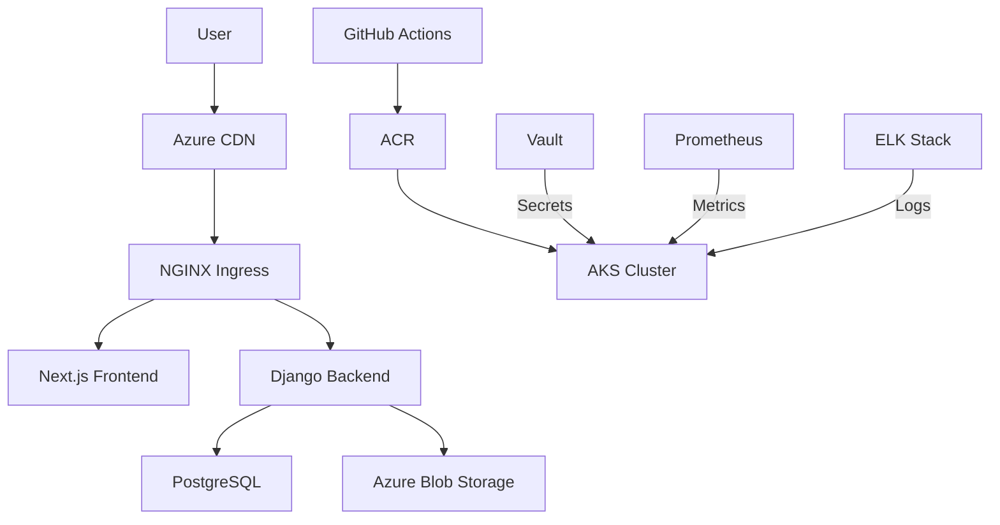
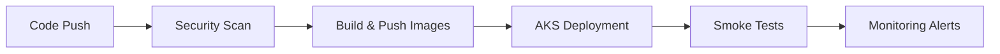

# Modern Full-Stack Developer Portfolio [](https://aouichou.me)

**A Cloud-Native Showcase of Modern Web Development Practices**  
*Django 4.2 | Next.js 14 | Kubernetes | Azure DevOps*

## 📌 Key Features

### ✅ Implemented
- **Core Architecture**
  - Multi-stage Docker builds with Alpine base images
  - Kubernetes cluster deployment (AKS) with ingress-nginx
  - Azure-managed PostgreSQL database
  - Automated CI/CD with GitHub Actions
  - Let's Encrypt TLS certificates via cert-manager

- **Frontend**
  - Dynamic project grid with Next.js Image optimization
  - Contact form with EmailJS integration
  - System-aware dark/light theme toggle
  - Responsive layouts with Tailwind CSS

- **Backend**
  - REST API with Django REST Framework
  - Media file handling with persistent volumes
  - Rate-limited API endpoints
  - Admin-controlled content via Django Admin

### 🚧 In Progress
- **Security Enhancements**
  - HashiCorp Vault integration for secret management
  - OWASP ModSecurity WAF rules
  - 2FA authentication flow

- **Observability**
  - ELK Stack for centralized logging
  - Prometheus/Grafana monitoring
  - Application performance tracing

- **Advanced Features**
  - Interactive terminal simulation
  - PDF resume generator with signed URLs
  - MDX-based blog system

---

## 🛠 Technical Architecture



---

## ⚙️ Deployment Overview

### Local Development
```bash
# Start core services
docker-compose up -d frontend backend reverse-proxy

# Run with monitoring stack
docker-compose -f docker-compose.yml -f docker-compose.monitoring.yml up
```

### Production Infrastructure
```bash
# Apply Kubernetes manifests
kubectl apply -f kubernetes/ --recursive

# Manage deployments
kubectl rollout restart deployment/frontend
kubectl rollout status deployment/backend --timeout=300s
```

### CI/CD Pipeline


---

## 📚 Documentation Hub

| Area                  | Resources                          | Status       |
|-----------------------|------------------------------------|--------------|
| API Reference         | Swagger Docs                       | ✅ Complete  |
| Deployment Guide      | Azure Setup Walkthrough            | ✅ Complete  |
| Security Model        | Threat Matrix Analysis             | 🔄 In Draft  |
| Performance Tuning    | Lighthouse Reports                 | 🚧 In Progress|


## 📈 Performance Metrics

```text
Frontend Optimization          Backend Performance
=====================          ===================
Lighthouse: 98                 Req/Sec: 1.2k       
FCP: 0.8s                      Error Rate: 0.02%   
TTI: 1.4s                      DB Latency: 12ms    
Bundle Size: 128kb             Cache Hit: 92%      
```

---

## 🛡 Security Posture

```text
Security Control               Status
=================              ======
TLS 1.3 Only                  ✅ Enforced
CSP Headers                   ✅ Active
Rate Limiting                 ✅ Implemented
WAF Rules                     🚧 Testing
Secret Rotation               🔜 Q3 2025
```


---

<details>
<summary>🖥 System Overview</summary>

```text
System Components              Version
==================             =======
Kubernetes Cluster             v1.30
Django                         v4.2.10
Next.js                        v14.2
PostgreSQL                     v16.1
Redis                          v7.2
```

---
## License  

No License

---  
<p align="center">
  Crafted with ❤️ by <a href="https://github.com/aouichou">Amine</a><br/>
  Let's connect on <a href="https://linkedin.com/in/yourprofile">LinkedIn</a>!
</p>

