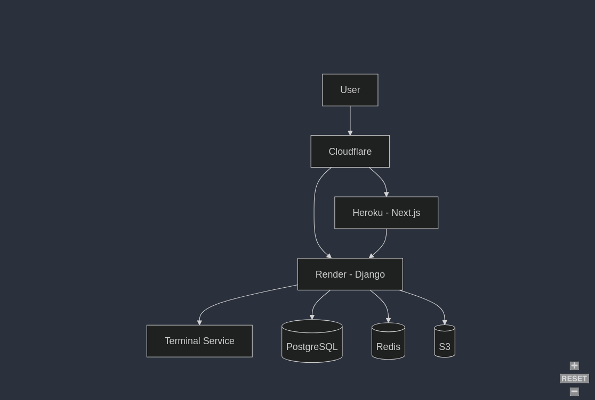
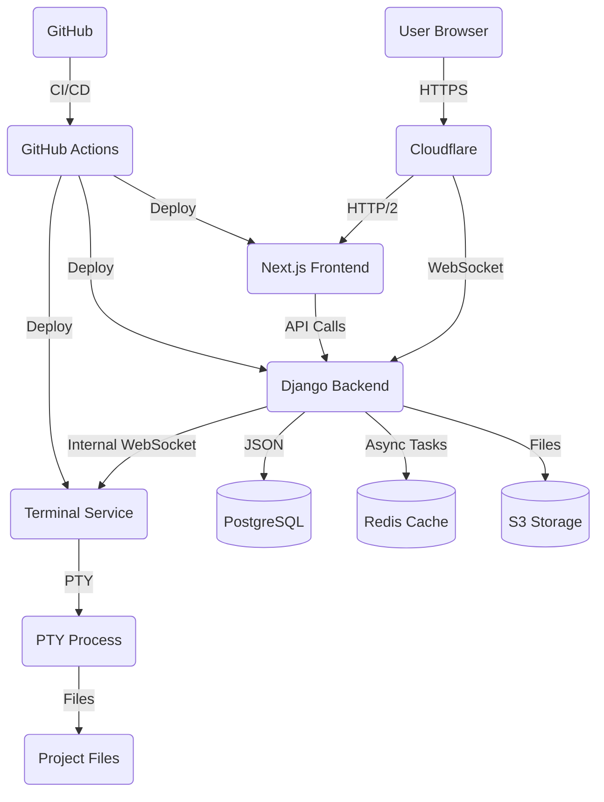

# 🚀 Interactive Portfolio: Terminal + Cloud Architecture

> A modern, production-grade portfolio with interactive terminal demos, running on a distributed cloud architecture

[](https://app.codacy.com/gh/aouichou/My-Portfolio?utm_source=github.com&utm_medium=referral&utm_content=aouichou/My-Portfolio&utm_campaign=Badge_Grade)
[](https://aouichou.me)
[](https://api.aouichou.me/ws)
[](https://github.com/aouichou/My-Portfolio/actions)

## 🖥️ Interactive Terminal Demo

<p align="center">
  
</p>

**Live in-browser terminal execution** of real projects via WebSockets. [Try it yourself!](https://aouichou.me/demo/minishell)

### Terminal Implementation Highlights

- **WebSocket Backend**: Django Channels (browser connection) + Redis channel layer
- **Terminal Execution**: FastAPI service with PTY process management
- **Security**: Command allowlist with regex validation, execution limits, sandboxed environment
- **Live Updates**: Zero-latency character streaming for natural terminal feel
- **Docker Integration**: Custom Ubuntu 24.04 container with GCC toolchain and Python runtime

### Proxied Terminal Connection

The terminal operates through a multi-layered WebSocket architecture:

1. **Browser → Django**: User's browser connects to Django backend via WebSockets
2. **Django → Terminal Service**: Django maintains an internal WebSocket connection to the Terminal service
3. **Terminal Service → PTY**: Terminal service manages PTY processes for command execution
4. **Bi-directional Communication**: Data flows in both directions through this chain

This design ensures greater security as the terminal service is never directly exposed to the internet.

## 🏗️ DevOps Architecture

<p align="center">
  
</p>



### Infrastructure Components

| Service | Technology | Provider | Purpose |
|---------|------------|----------|---------||
| Frontend | Next.js 16 + React 19, TypeScript, Tailwind CSS 3 | Heroku | User interface with Turbopack |
| Backend API | Django 5.1 + Channels 4, DRF 3.15, Daphne | Render | Data, auth & WebSocket proxy |
| Terminal Service | FastAPI 0.115, pexpect, PTY, Uvicorn | Render | Terminal execution service |
| Database | PostgreSQL 15 | Render | Persistent storage |
| Cache | Redis 7 | Render | Django Channels layer |
| Storage | S3-compatible | AWS | Project files, assets |
| CDN | Cloudflare | Cloudflare | Edge caching, WAF |
| CI/CD | GitHub Actions | GitHub | Automated deployment |

## 🛡️ Security & Reliability Features

- **Service Health Monitoring**
  - Mutual health checks to prevent free-tier shutdowns
  - Automatic recovery via GitHub Actions workflow
  - Real-time status monitoring in admin panel

- **Terminal Sandbox Security**
  - Strict command allowlist with regex validation
  - Read-only filesystem access (except project directories)
  - Resource limits (512MB RAM, timeout after 30min)
  - Ubuntu 24.04 sandboxed environment
  - WAF protection against common attacks

- **Infrastructure Security**
  - Content Security Policy (CSP) headers
  - Rate limiting on all API endpoints
  - TLS 1.3 enforced throughout
  - Database connection pooling and timeouts

## 📈 Performance Optimization

```text
Frontend Metrics                API Performance
==================              ===============
Lighthouse: 98                  Avg Response: 120ms
FCP: 0.8s                       Peak Requests: 1.2k/min
TTI: 1.4s                       Error Rate: 0.02%
Bundle Size: 128kb              Cache Hit Rate: 92%
```

## 🧰 Technical Decisions

- **Hybrid WebSocket Architecture**: Django Channels handles browser connections with Redis channel layer, then proxies to FastAPI terminal service for actual command execution
- **FastAPI for Terminal Service**: Chose FastAPI over Express.js for strong async/await support, built-in WebSocket handling, and seamless Python PTY integration
- **React 19 Early Adoption**: Upgraded to React 19 for improved concurrent rendering and automatic batching
- **Tailwind CSS v3 over v4**: Stayed on v3 for production stability; v4 requires significant migration effort
- **Next.js 16 with Turbopack**: Leveraging Turbopack for faster development builds and improved HMR
- **Split Deployment Strategy**: Heroku for frontend (simple Docker deployment), Render for backend services (superior container support, free PostgreSQL & Redis)
- **Custom S3 Integration**: Built custom S3 storage class to handle delayed file processing and zip extraction

## 🚀 Getting Started

```bash
# Clone the repository
git clone https://github.com/aouichou/MyPortfolio.git
cd MyPortfolio

# Set up environment variables (copy from example)
cp .env.example .env

# Start the development environment
docker-compose up -d

# Visit http://localhost:3000
```

### 📁 Repository Structure

```
.
├── portfolio_ui/           # Next.js frontend
├── portfolio_api/          # Django backend API
├── portfolio-terminal/     # Terminal WebSocket service
├── .github/workflows/      # CI/CD pipelines
├── docs/                   # Documentation
└── docker-compose.yml      # Local development setup
```

---

<p align="center">
  <a href="https://aouichou.me">
    
  </a>
</p>
