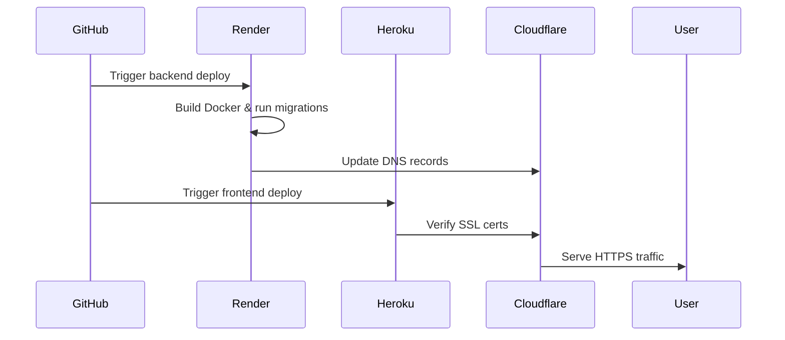
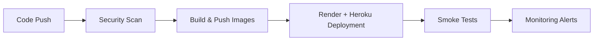

# Modern Full-Stack Developer Portfolio [](https://aouichou.me)

**A Cloud-Native Showcase of Modern Web Development Practices**  
*Django 4.2 | Next.js 14 | Docker + Render + Heroku DevOps*

## 📌 Key Features

### ✅ Implemented
- **Core Architecture**
  - Multi-stage Docker builds with Alpine base images
  - Render + Heroku deployment (Docker) with nginx
  - Render-managed PostgreSQL database
  - Automated CI/CD with GitHub Actions
  - Let's Encrypt TLS certificates via cert-manager

- **Frontend**
  - Dynamic project grid with Next.js Image optimization
  - Contact form with EmailJS integration
  - System-aware dark/light theme toggle
  - Responsive layouts with Tailwind CSS

- **Backend**
  - REST API with Django REST Framework
  - Media file handling with persistent volumes
  - Rate-limited API endpoints
  - Admin-controlled content via Django Admin

### 🚧 In Progress
- **Observability**
  - ELK Stack for centralized logging
  - Prometheus/Grafana monitoring
  - Application performance tracing

- **Advanced Features**
  - Interactive terminal simulation
  - PDF resume generator with signed URLs
  - MDX-based blog system

---

## 🛠 Technical Architecture



---

## ⚙️ Deployment Overview

### Local Development
```bash
# Start core services
docker-compose up -d frontend backend reverse-proxy

# Run with monitoring stack
docker-compose -f docker-compose.yml -f docker-compose.monitoring.yml up
```

### CI/CD Pipeline


---

## 📈 Performance Metrics

```text
Frontend Optimization          Backend Performance
=====================          ===================
Lighthouse: 98                 Req/Sec: 1.2k       
FCP: 0.8s                      Error Rate: 0.02%   
TTI: 1.4s                      DB Latency: 12ms    
Bundle Size: 128kb             Cache Hit: 92%      
```

---

## 🛡 Security Posture

```text
Security Control               Status
=================              ======
TLS 1.3 Only                  ✅ Enforced
CSP Headers                   ✅ Active
Rate Limiting                 ✅ Implemented
WAF Rules                     🚧 Testing
Secret Rotation               🔜 Q3 2025
```

---

<details>
<summary>🖥 System Overview</summary>

```text
System Components              Version
==================             =======
Django                         v5.0.11
Next.js                        v15.1.6
```
</details>

---

## 📬 Let's Connect!

<p align="center">
  <a href="https://www.linkedin.com/in/amine-ouichou-168236345" target="_blank">
    
  </a>
  <a href="mailto:aouichou.gmail.com">
    
  </a>
  <a href="https://aouichou.me">
    
  </a>
</p>

<p align="center">
  <a href="https://github.com/aouichou">
    
  </a>
  <a href="https://github.com/aouichou?tab=repositories">
    
  </a>
</p>

<p align="center">
  <em>"Building robust systems from kernel to cloud"</em>
</p>

<p align="center">
  © 2024 Amine Ouichou | <a href="https://aouichou.me/privacy">Privacy Policy</a> | <a href="https://aouichou.me/terms">Terms of Use</a>
</p>
